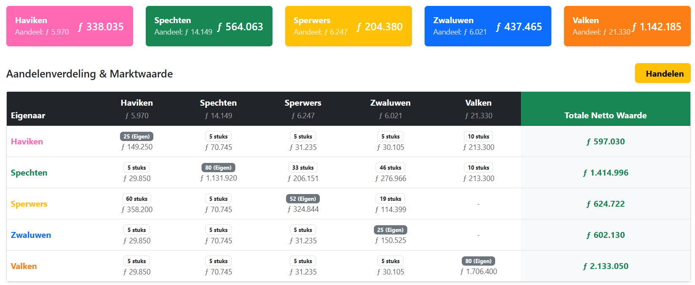
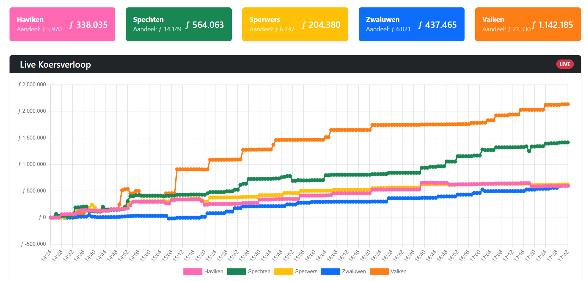
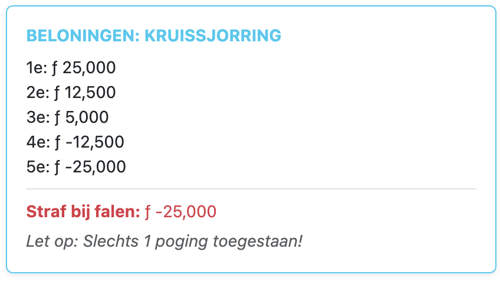

# 📈 Spelregels & Handleiding: Het Grote Beursspel

Welkom bij het Beursspel! In deze game strijden verschillende patrouilles (de Haviken, Spechten, Sperwers, Zwaluwen en Valken) als bedrijven tegen elkaar én tegen **De Staf** om de machtigste en rijkste patrouille te worden.

Het doel van het spel is simpel: zorg dat jouw patrouille aan het eind van het spel de hoogste **Totale Netto Waarde** heeft. Dit doe je door taken succesvol (en als eerste!) uit te voeren, slim te handelen in aandelen, en strategische deals te sluiten.

---

## 🖥️ 1. Het Dashboard & Jouw Portfolio (De 'Fog of War')

Zodra je inlogt met het account van jouw patrouille, zie je het hoofdoverzicht met de status van alle groepen in het spel.

### Begrippenlijst
* **Cash ($f$):** Het liquide geld dat jouw groep momenteel op de bank heeft staan (in Guldens). Hiermee kun je aandelen kopen of rekeningen betalen.
    * *Let op (Fog of War):* Je ziet alleen je eigen Cash bovenaan in het scherm. Het saldo van andere groepen is streng geheim en verborgen!
* **Koerswaarde / Aandeelwaarde:** Wat 1 aandeel van een groep op dit moment waard is. Dit is voor iedereen openbaar.
* **Totale Netto Waarde:** Jouw Cash + de totale waarde van alle aandelen die je bezit. *Dit is het getal dat bepaalt wie er wint!*

### De Aandelenverdeling (Portfolio)
In de grote tabel onder de tab *Aandelenverdeling* zie je precies wie wat bezit. Elke patrouille begint standaard met een aandelenpakket:
* **25 aandelen** van de eigen familie/patrouille.
* **5 aandelen** van elke andere patrouille.
* **5 aandelen** van De Staf.
* De Bank (de spelleiding) beheert de rest van de aandelen (50 stuks per groep).

**Tip:** Kijk goed naar de "Eigen" badges in de tabel. Als je veel aandelen hebt van een groep die goed presteert, stijgt jouw eigen Netto Waarde automatisch mee!

---

## 📈 2. De Live Koers & Het Algoritme

Op een gegeven moment gaat de aandelenbeurs open. Het hart van het spel is het **Live Koersverloop** onder de tab *Grafiek*. Deze grafiek updatet live en laat precies zien wie er aan het winnen is.

### Hoe werkt de koers?
De aandelenkoers van een patrouille wordt volledig bepaald door de hoeveelheid Cash die zij tot dan toe verdiend hebben. De wiskunde is simpel:
> **1 Aandeel is 1% waard van het geld dat de familie heeft. (Koers = Cash / 100)**

* *Voorbeeld:* Als de Spechten om 15:00 uur $f$ 300.000 Cash hebben verdiend, is ieder aandeel Spechten $f$ 3.000 waard.
* De aandelen kunnen vanaf de beursopening tot het einde van het spel op en neer schommelen afhankelijk van jullie prestaties.

---

## 🛠️ 3. Geld Verdienen (Het 'One-Shot' Taaksysteem)

Van je spelleiding krijg je een a4tje met alle opdrachten die je kunt uitvoeren. Deze taken zijn verdeeld in verschillende categorieën (Vragen, 3e Klasse, 2e Klasse, Overige, 1e Klasse) en hebben verschillende beloningen.
Onder de tab *Opdrachten* verdien (of verlies!) je cash door taken uit te voeren.
Iedere patrouille mag zelf beslissen wat ze doen en wanneer ze het doen. Maar let op: **Snelheid is cruciaal!** 
### De Beloningen & Straffen (First Come, First Serve)
Elke patrouille heeft **slechts 1 poging** per opdracht. De opbrengst is afhankelijk van hoe snel je bent vergeleken met de andere patrouilles. Ben je te laat? Dan kost het je geld!
* **1e groep die het haalt:** Krijgt de hoofdprijs.
* **2e groep die het haalt:** Krijgt de helft van de hoofdprijs.
* **3e groep die het haalt:** Krijgt nog een kleine vergoeding.
* **4e en 5e groep:** Jullie zijn te laat. De opdracht kan wel nog goedgekeurd worden, maar het kost je altijd geld!
* **Mislukt / Fout uitgevoerd:** Als je een taak fout doet, de tijd om is, of je het opgeeft (de rode knop), krijg je direct de harde Boete (Penalty) afgeschreven van je Cash. Je mag deze taak niet meer opnieuw proberen.

*Eerlijkheid:* Als een andere groep faalt, nemen zij geen 'winnende plek' in. Jouw groep kan dus nog steeds de 1e prijs pakken als jullie de eerste zijn die de taak wél succesvol afronden!
### Prijzenschema

| Categorie     | 1e Plaats   | 2e Plaats  | 3e Plaats  | 4e / 5e Plaats (Te laat)   | Mislukt (Boete) |
|:--------------|:------------|:-----------|:-----------|:---------------------------|:----------------|
| **Vragen**    | $f$ 5.000   | $f$ 2.500  | $f$ 1.000  | -$f$ 2.500 / -$f$ 5.000    | -$f$ 5.000      |
| **3e Klasse** | $f$ 25.000  | $f$ 12.500 | $f$ 5.000  | -$f$ 12.500 / -$f$ 25.000  | -$f$ 25.000     |
| **2e Klasse** | $f$ 50.000  | $f$ 25.000 | $f$ 10.000 | -$f$ 25.000 / -$f$ 50.000  | -$f$ 50.000     |
| **Overige**   | $f$ 50.000  | $f$ 25.000 | $f$ 10.000 | -$f$ 25.000 / -$f$ 50.000  | -$f$ 50.000     |
| **1e Klasse** | $f$ 100.000 | $f$ 50.000 | $f$ 20.000 | -$f$ 50.000 / -$f$ 100.000 | -$f$ 100.000    |

---

## 💸 4. Mijn Rekening & Geld Overmaken

Samenwerken of elkaar afpersen? Het kan allemaal via de tab *Mijn Rekening / Transacties*.
Hier zie je jouw persoonlijke bankafschrift met alle inkomsten uit taken en boetes. Andere groepen kunnen jouw afschrift niet zien.

**Geld Overmaken:**
Rechtsboven vind je de knop *Geld Overmaken*. Hiermee kun je direct Cash sturen naar een andere patrouille.
1. Selecteer de ontvanger.
2. Vul het bedrag in.
3. Voeg een omschrijving toe (bijv. "Betaling voor hout", of "Lening afbetalen").
   *Let op: Je kunt alleen geld uitgeven dat je daadwerkelijk hebt!*

---

## 🤝 5. Aandelen Handelen & Onderhandelen

Je kunt je geld ook investeren om je Netto Waarde te laten groeien zonder zelf taken te doen.

### A. Kopen van de Bank (Direct)
Via de spelleiding kun je aandelen kopen die nog in beheer van de Bank zijn. Je betaalt de huidige marktprijs. Dit wordt direct verwerkt.

### B. Trade Offers (Onderhandelen met spelers)
Wil je aandelen overkopen van een andere familie, maar vind je de marktprijs te hoog? Dan kun je een **Bod (Trade Offer)** sturen via het systeem!
1. Jij stuurt een bod (bijv. "Ik bied $f$ 15.000 voor 10 aandelen").
2. De andere patrouille krijgt een melding en kan dit accepteren of afwijzen.
3. **Systeemcheck:** Als het bod wordt geaccepteerd, controleert het systeem of de koper nog wel genoeg geld heeft, en de verkoper nog genoeg aandelen. Zo ja, dan is de deal direct rond!

---

## 🚨 6. De Staf

**De Staf** (herkenbaar aan de rode kleur) doet ook mee op de beurs. Zij werken als een speciale computergestuurde speler in het systeem.

* **De Staf** doet geen taken. In plaats daarvan rollen zij elke minuut virtuele dobbelstenen. Soms krijgen ze "Subsidie" (en stijgt hun koers), soms hebben ze "Materiaalkosten" (en daalt hun koers). Ze vormen de nullijn van het spel: *Als jouw groep onder de rode lijn van De Staf staat, doe je iets verkeerd!*
* **De Staf** houdt de markt nauwlettend in de gaten. Faalt jouw patrouille een taak en verlies je veel geld? Dan ruikt De Staf bloed. Ze kunnen je automatisch een meedogenloos *Trade Offer* sturen om jouw aandelen op te kopen met 30% korting terwijl je kwetsbaar bent. Jij mag kiezen: weiger je het beledigende bod, of heb je de cash te hard nodig?

---

### 🏆 Hoe win je het spel?
1. **Snelheid:** Doe je taken als eerste (1e plekken leveren het meeste op, te laat zijn of fouten maken wordt keihard afgestraft).
2. **Investeren:** Koop vroeg in het spel aandelen van patrouilles (of De Staf!) waarvan je denkt dat ze veel gaan verdienen.
3. **Onderhandelen:** Wees niet bang om strategische deals te sluiten of geld te lenen via de overboekingen en Trade Offers.
4. **Eindafrekening:** Aan het einde van de dag koopt de bank de vier families op voor de prijs die op dat moment voor de aandelen betaald moet worden. Zorg dat je aan het eind van het spel de allerhoogste **Totale Netto Waarde** hebt!
